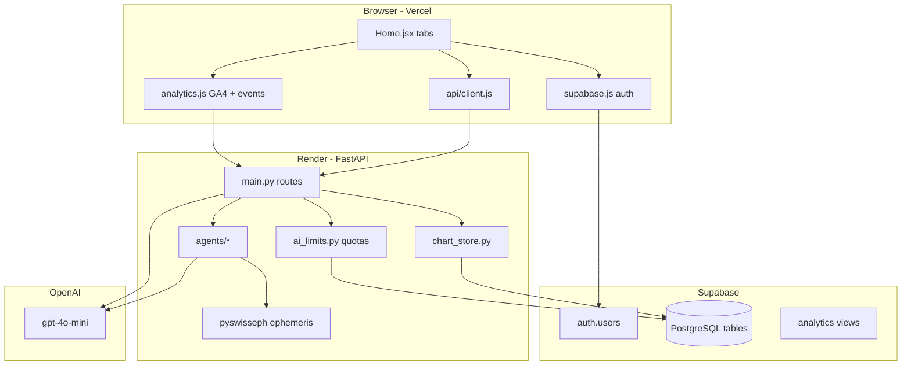

# Parashara Jyotish (jyotish-ai) — Developer Guide

Comprehensive reference for building, deploying, debugging, and extending the app.  
Audience: engineers who may never have seen this codebase before.

**Related docs:** [README.md](../README.md) · [docs/README.md](./README.md) · [FEATURES-TECHNICAL-REFERENCE.md](./FEATURES-TECHNICAL-REFERENCE.md) · [SECURITY.md](../SECURITY.md) · [STEP-1](./STEP-1-PRODUCTION-CONFIG.md) through [STEP-4-7](./STEP-4-7-COMPLETE.md) · [ADMIN-DASHBOARD.md](./ADMIN-DASHBOARD.md) · [SUPABASE-ANALYTICS-DASHBOARD.md](./SUPABASE-ANALYTICS-DASHBOARD.md)

---

## Table of contents

1. [What is this app?](#1-what-is-this-app)
2. [Is it an agentic AI app?](#2-is-it-an-agentic-ai-app)
3. [Architecture overview](#3-architecture-overview)
4. [Repository structure](#4-repository-structure)
5. [Tech stack](#5-tech-stack)
6. [Local development — step by step](#6-local-development--step-by-step)
7. [Database (Supabase PostgreSQL)](#7-database-supabase-postgresql)
8. [Backend deep dive](#8-backend-deep-dive)
9. [Frontend deep dive](#9-frontend-deep-dive)
10. [AI vs rule-based feature map](#10-ai-vs-rule-based-feature-map)
11. [End-to-end data flows](#11-end-to-end-data-flows)
12. [API reference](#12-api-reference)
13. [Authentication & security](#13-authentication--security)
14. [Deployment](#14-deployment)
15. [Testing & CI](#15-testing--ci)
16. [Debugging playbook](#16-debugging-playbook)
17. [How to extend the app](#17-how-to-extend-the-app)
18. [Astrological conventions](#18-astrological-conventions)
19. [Vimshottari Dasha engine & Chat AI grounding](#19-vimshottari-dasha-engine--chat-ai-grounding)
20. [Feature modules (Career, Health, Dosha Radar, Horai, Bhavam)](#20-feature-modules-career-health-dosha-radar-horai-bhavam)

---

## 1. What is this app?

**Parashara Jyotish** is a Vedic astrology web application:

- Users enter birth details → receive a **sidereal natal chart** (D1, D9, dasha, yogas).
- **Panchangam** (daily almanac) for supported cities.
- **Personal Panchangam** — Tara Balam, Chandra Ashtama, Chandrabalam from natal Moon.
- **Gochara** — deterministic transit scores from natal Moon (Parasara rules + Vedha).
- **Forecast** — rule-based scores + **AI narrative** (daily reading, per-house insight).
- **Ask AI** — multi-turn chat grounded in the user's chart.
- **Prashna** — horary astrology via a **12-engine rule pipeline**, optional AI narration.
- **Ashtakavarga** — BAV/SAV grid.
- **Career** — D1 + D10 Dasamsa, 10 PDF10 rules, profession tags, Dasa timing.
- **Health** — D3 Drekkana body map, Dasa/Bhukti + transit awareness (bilingual EN/TA).
- **Dosha Radar** — live obstruction doshas, Pushkara Navamsa, 90-day forecast (dedicated tab).
- **Horai & Uba Horai** — planetary hours inside Panchangam (fixed 6 AM or sunrise slots).
- **Bhavat Bhavam** — D1 house-from-house support/recovery paths (Career + Health layers).
- **Tamil Doshas** — Thithi Soonyam, Mudakku, Vadhai/Vainasikam, Yogi/Avayogi (My Chart; links to Dosha Radar).
- **Indu Lagna** — fortune lagna + wealth-favourable Dasa/transit windows.

**Production layout:**

| Layer | Host | Path |
|-------|------|------|
| React SPA | Vercel | `frontend/` |
| FastAPI API | Render | `backend/` |
| PostgreSQL + Auth | Supabase | SQL in `supabase/` |

---

## 2. Is it an agentic AI app?

**Short answer: hybrid — mostly deterministic astrology engines with an LLM narration layer. It is not a tool-calling / autonomous agent framework.**

### What it is

| Pattern | Present? | Where |
|---------|----------|-------|
| Deterministic calculation engines | ✅ | `natal_agent`, `dasha_agent`, `panchangam_agent`, `transit_score_agent`, `ashtakavarga_agent`, `dosha_radar_agent`, `tara_engine`, `prashna/*_engine.py` |
| Context assembly before LLM | ✅ | `orchestrator.py` gathers natal + dasha + panchangam + tara + SAV → `narrator.py` |
| LLM for natural language | ✅ | OpenAI `gpt-4o-mini` in `narrator.py`, `chat_agent.py`, `prashna/ai_narrator.py`, inline in `main.py` |
| Multi-step rule pipeline | ✅ | Prashna: chart → lagna → house → moon → verdict (no LLM until optional narrate step) |
| Autonomous agents (ReAct, tool loops) | ❌ | No LangChain, no function-calling loops, no self-directed planning |
| Anthropic Claude in production | ❌ | `ANTHROPIC_API_KEY` in `.env.example` but **unused in code** |

### Mental model

```
User request
    │
    ├─► Rule engine(s)  ──► structured JSON scores / verdict / chart
    │         │
    │         └─► (optional) Orchestrator assembles prompt context
    │                       │
    │                       └─► OpenAI gpt-4o-mini → human-readable text
    │
    └─► Pure rule response (no LLM) e.g. /forecast/scores, /ashtakavarga
```

**Gochar tab** = 100% rule engine (`POST /forecast/scores`).  
**Forecast tab** = same scores + AI daily note / house insight.  
**Prashna** = rule verdict first; AI only if `include_ai=true`.

---

## 3. Architecture overview



### Request path (authenticated user)

1. User signs in via Supabase magic link → JWT in browser.
2. `api/client.js` attaches `Authorization: Bearer <jwt>` on every API call.
3. Backend `auth.py` verifies JWT with `SUPABASE_JWT_SECRET`.
4. Chart endpoints load/save from `natal_charts.chart_data` (not from request body when signed in).
5. AI routes check `ai_usage` / `anon_ai_usage` quotas before calling OpenAI.

---

## 4. Repository structure

```
jyotish-ai/
├── backend/                    # Python FastAPI (Render root directory)
│   ├── main.py                 # All HTTP routes + middleware
│   ├── admin_router.py         # Owner dashboard API (/admin/*)
│   ├── auth.py                 # JWT verification
│   ├── chart_store.py          # natal_charts read/write
│   ├── chart_utils.py          # Dasha backfill, fingerprint
│   ├── ai_limits.py            # Daily AI quotas + prompt moderation
│   ├── analytics.py            # app_events insert
│   ├── ephemeris.py            # Swiss Ephemeris wrapper (Lahiri)
│   ├── supabase_client.py      # Service-role Supabase client
│   ├── agents/
│   │   ├── natal_agent.py      # Birth chart
│   │   ├── dasha_agent.py      # Vimshottari dasha
│   │   ├── panchangam_agent.py # Daily panchangam
│   │   ├── transit_score_agent.py  # Gochara / 12-house RAG
│   │   ├── ashtakavarga_agent.py
│   │   ├── tara_engine.py      # Tara / Ashtama / Chandrabalam
│   │   ├── ashtama_agent.py    # FastAPI router (personal panchangam)
│   │   ├── sky_today_agent.py    # Cosmos strip header
│   │   ├── orchestrator.py     # Forecast context assembly
│   │   ├── narrator.py         # AI forecast XML sections
│   │   ├── chat_agent.py       # AI chat + multi-context grounding
│   │   ├── career_agent.py     # D1+D10 career prediction
│   │   ├── career/             # d10, rules, profession, timing, atmakaraka
│   │   ├── health_agent.py     # D3 health awareness
│   │   ├── health/             # d3, body_map, warnings
│   │   ├── bhavat_bhavam_agent.py
│   │   ├── bhavat_bhavam/      # core + slices
│   │   ├── tamil_dosha_agent.py
│   │   ├── tamil_dosha/        # soonyam, mudakku, yogi, red_zones
│   │   ├── dosha_radar_agent.py
│   │   ├── dosha_radar/        # pushkara, afflictions, obstruction
│   │   ├── indu_lagna_agent.py
│   │   └── prashna/            # 12 rule engines + ai_narrator
│   ├── tests/                  # pytest (~95 tests, no network/OpenAI)
│   └── requirements.txt
│
├── frontend/                   # React + Vite (Vercel root directory)
│   ├── src/
│   │   ├── pages/Home.jsx      # Single-page app — all tabs
│   │   ├── components/         # UI by feature (DoshaRadarPanel, HoraiPanel, …)
│   │   ├── lib/                # chartPayload, horai.js, analytics, …
│   │   ├── api/client.js       # Axios + JWT interceptor
│   │   ├── hooks/              # useAuth, useIsAdmin
│   │   └── constants/          # Prashna catalog, legal text
│   └── package.json
│
├── supabase/                   # SQL migrations (run in Supabase SQL Editor)
│   ├── schema_steps_4_5_7.sql
│   ├── schema_security_patch.sql
│   ├── anon_ai_usage.sql
│   ├── analytics_events.sql
│   ├── analytics_views.sql
│   ├── prashna_sessions.sql
│   └── panchangam_sql/         # Bulk panchangam cache inserts
│
├── docs/                       # Step guides + this file + FEATURES-TECHNICAL-REFERENCE.md
├── README.md                   # Quick start pointer
├── SECURITY.md
└── .github/workflows/ci.yml
```

> **Note:** Docs reference `schema.sql` and `schema_ashtama.sql` as base migrations. Those files are **not currently in the git repo** — if setting up a fresh Supabase project, export the live schema from your production project (Dashboard → Database → Schema) or reconstruct from the table definitions in [Section 7](#7-database-supabase-postgresql).

---

## 5. Tech stack

| Area | Technology |
|------|------------|
| Frontend | React 19, Vite 8, Tailwind CSS 4, Axios |
| Backend | FastAPI 0.115, uvicorn, Python 3.11 |
| Ephemeris | pyswisseph 2.10 (Lahiri ayanamsa, sidereal) |
| Database | Supabase PostgreSQL + Row Level Security |
| Auth | Supabase Auth (magic link email) + JWT on API |
| AI | OpenAI API (`gpt-4o-mini`) |
| Rate limiting | slowapi |
| Scheduling | APScheduler (daily ashtama job in `ashtama_agent.py`) |
| CI | GitHub Actions — pytest + frontend build |
| Hosting | Render (API) + Vercel (SPA) |

---

## 6. Local development — step by step

### Prerequisites

- Node.js 20+
- Python 3.11
- Supabase project (free tier works)
- OpenAI API key (for AI features only)

### Step 1 — Clone and env files

```bash
git clone https://github.com/sivaramanrajagopal/jyotish-ai.git
cd jyotish-ai

cp backend/.env.example backend/.env
cp frontend/.env.example frontend/.env.local
```

### Step 2 — Supabase setup

1. Create project at [supabase.com](https://supabase.com).
2. Run SQL files in order (see [Section 7](#7-database-supabase-postgresql)).
3. Enable **Email** auth provider.
4. Set **Site URL** to `http://localhost:5173` for local dev.
5. Copy **Project URL**, **anon key**, **service role key**, **JWT secret** from Settings → API.

### Step 3 — Backend env (`backend/.env`)

```env
SUPABASE_URL=https://xxxx.supabase.co
SUPABASE_SERVICE_KEY=eyJ...        # service role — never expose to frontend
SUPABASE_JWT_SECRET=your-jwt-secret
OPENAI_API_KEY=sk-proj-...
ALLOWED_ORIGINS=http://localhost:5173
APP_ENV=development
ADMIN_EMAILS=you@example.com
ANON_IP_HASH_SALT=any-random-string
```

### Step 4 — Frontend env (`frontend/.env.local`)

```env
VITE_API_URL=http://localhost:8000
VITE_SUPABASE_URL=https://xxxx.supabase.co
VITE_SUPABASE_ANON_KEY=eyJ...anon...
VITE_SITE_URL=http://localhost:5173
VITE_ADMIN_EMAILS=you@example.com
```

### Step 5 — Install and run

```bash
# Terminal 1 — backend
cd backend
python3 -m venv .venv
source .venv/bin/activate
pip install -r requirements.txt
uvicorn main:app --reload --port 8000

# Terminal 2 — frontend
cd frontend
npm install
npm run dev
```

Open `http://localhost:5173`.

### Step 6 — Verify

```bash
curl http://localhost:8000/ping
# {"pong": true}

curl "http://localhost:8000/panchangam/today?location=Chennai"
# JSON panchangam

curl http://localhost:8000/health
# checks Supabase, ephemeris, dasha
```

### Step 7 — Optional panchangam cache preload

```bash
cd backend
python scripts/preload_panchangam.py
# Generates supabase/panchangam_sql/*.sql — run in Supabase SQL Editor
```

---

## 7. Database (Supabase PostgreSQL)

### SQL run order (fresh project)

| Order | File | Purpose |
|-------|------|---------|
| 1 | `schema.sql` *(export from prod or legacy)* | Core tables: users, natal_charts, panchangam_daily, locations, forecasts, chat_history |
| 2 | `schema_ashtama.sql` *(export from prod)* | moon_daily, tara_lookup, ashtama_lookup, user_daily_panchangam, ashtama_alerts, user_locations |
| 3 | `schema_security_patch.sql` | RLS policy hardening |
| 4 | `schema_steps_4_5_7.sql` | chart_data JSONB, auth.users trigger, ai_usage |
| 5 | `anon_ai_usage.sql` | Guest IP-hash quotas |
| 6 | `analytics_events.sql` | app_events table |
| 7 | `analytics_views.sql` | Admin dashboard views |
| 8 | `prashna_sessions.sql` | Optional horary history |
| 9 | `panchangam_sql/*.sql` | Optional bulk cache |

All scripts in `supabase/` use `IF NOT EXISTS` / `DROP POLICY IF EXISTS` where possible — safe to re-run.

### Tables reference

#### `users`

Synced from `auth.users` via trigger in `schema_steps_4_5_7.sql`.

| Column | Type | Notes |
|--------|------|-------|
| id | UUID PK | Same as auth.users.id |
| email | TEXT | |
| name | TEXT | From metadata or email prefix |
| subscription_tier | TEXT | Default free |
| created_at, updated_at | TIMESTAMPTZ | |

#### `natal_charts`

One row per user (`user_id` unique).

| Column | Type | Notes |
|--------|------|-------|
| user_id | UUID FK | |
| sun_sign, moon_sign, ascendant | TEXT | Denormalized for queries |
| planet_positions | JSONB | Legacy flat positions |
| chart_data | JSONB | **Full chart** — source of truth (Step 4) |
| birth_form | JSONB | dob, tob, place, gender (no localStorage PII) |
| yogas | JSONB | |
| ayanamsa, ayanamsa_value | TEXT/FLOAT | Lahiri |
| moon_nakshatra_index, moon_rasi_index | INT | For Tara/Ashtama |
| calculated_at | TIMESTAMPTZ | |

Written by: `chart_store.save_natal_chart()` on `POST /natal-chart`.  
Read by: `chart_store.load_natal_chart()` on `GET /natal-chart` and all authenticated AI/score routes.

#### `panchangam_daily`

Cache key: `(date, location_name)`.

Columns include: `date`, `location_name`, `lat`, `lon`, `timezone`, tithi/nakshatra/yogam/karanam fields, sunrise/sunset, rahu kalam, etc. (see `panchangam_agent.calculate_panchangam` return dict; `ayanamsa` fields excluded on write).

#### `user_daily_panchangam`

Per-user daily Tara/Ashtama snapshot (written by `ashtama_agent.py`).

Key columns: `user_id`, `date`, `tara_name`, `tara_nature`, `is_chandra_ashtama`, `ashtama_start/end`, `chandrabalam_good`, `moon_house_from_natal`, etc.

#### `user_locations`

User's current city/timezone for personal panchangam.

#### `ai_usage`

Daily per-user AI quotas.

| Column | Type |
|--------|------|
| user_id, usage_date | PK |
| chat_count | INT |
| forecast_count | INT |

#### `anon_ai_usage`

Daily guest quotas keyed by hashed IP (`ai_limits.py`).

#### `app_events`

Product analytics (`analytics_events.sql`).

| Column | Type |
|--------|------|
| id | BIGSERIAL PK |
| user_id | UUID nullable |
| event_name | TEXT | e.g. `tab_view`, `chart_calculated`, `sign_in` |
| properties | JSONB |
| created_at | TIMESTAMPTZ |

#### `prashna_sessions`

Optional signed-in horary history (`prashna_sessions.sql`).

#### `forecasts`, `chat_history`

Legacy/historical storage — RLS policies in security patch; primary UX uses live API responses.

### Analytics views (`analytics_views.sql`)

| View | Purpose |
|------|---------|
| `v_users_overview` | Users + chart + location join |
| `v_signups_daily` | Registration trend |
| `v_birth_places` | Birth place distribution |
| `v_user_cities` | Current city distribution |
| `v_ai_usage_daily` | AI call volume |
| `v_tara_today` | Today's Tara distribution |
| `v_moon_sign_distribution` | User base moon signs |

Used by `AdminPanel.jsx` via `GET /admin/*`.

### Row Level Security (RLS)

- User tables: `auth.uid() = user_id` for SELECT/INSERT/UPDATE/DELETE.
- `panchangam_daily`, `locations`: public read.
- `anon_ai_usage`: no client policies — backend service role only.
- `app_events`: users insert own rows; service role reads all.

Backend uses **service role key** — bypasses RLS for admin and server writes.

---

## 8. Backend deep dive

### Entry point: `main.py`

Responsibilities:

- FastAPI app + lifespan (scheduler startup)
- CORS from `ALLOWED_ORIGINS`
- Rate limits via `@limiter.limit`
- Request body size cap (`MAX_JSON_BODY_BYTES`)
- Security headers middleware
- Includes routers: `ashtama_router`, `admin_router`

### Core modules

| Module | Role |
|--------|------|
| `ephemeris.py` | Swiss Ephemeris init, Lahiri ayanamsa, planet positions |
| `chart_utils.py` | `ensure_dasha()`, `chart_fingerprint()` |
| `chart_store.py` | `save_natal_chart`, `load_natal_chart`, `resolve_natal_chart` |
| `auth.py` | `get_current_user`, `get_current_user_optional`, `require_path_user` |
| `ai_limits.py` | `check_and_increment_quota`, `moderate_messages` |
| `location_utils.py` | Geocoding via geopy |
| `rate_limit.py` | slowapi Limiter instance |
| `production_check.py` | Warns on missing env in production |

### Agents

#### `natal_agent.py`

- Input: date, time, lat, lon, timezone
- Output: `planet_positions`, `ascendant`, `navamsa_positions`, `yogas`, `houses`, indices for Moon
- House system: **Whole Sign** (Vedic standard)
- Ayanamsa: **Lahiri** (sidereal)

#### `dasha_agent.py` + `dasha_logic.py`

Vimshottari Mahadasha/Bhukti from Moon nakshatra lord.

#### `transit_score_agent.py`

Main function: `score_all_houses(natal_chart, transit_date, transit_time, dasha)`.

Returns:

```json
{
  "houses": { "1": { "score", "rag", "lord", "transit_score", ... }, ... },
  "overall_health": { "average_score", "green_count", "rag", ... },
  "transit_analysis": [ { "planet", "pos_from_moon", "score", "vedha_blocked", ... } ],
  "dasha_transit": { "correlation_score", "summary", "mahadasha", "bhukti" },
  "transit_moment": { "local_iso", "utc_iso", ... },
  "gochara_note": "..."
}
```

Blend formula (in `meta.blend`): **55% natal lord + 35% Gochara + 10% SAV**.

#### `orchestrator.py` + `narrator.py`

1. `assemble_context(natal_chart, location, ...)` pulls dasha, panchangam, personal panchangam, BAV/SAV snippet.
2. `generate_forecast(context)` calls OpenAI with XML output tags: `<career>`, `<love>`, `<health>`, etc.

#### `chat_agent.py`

Builds system prompt with compact chart + Gochara summary; multi-turn messages to OpenAI.

#### Prashna pipeline (`agents/prashna/`)

```
analyze_prashna()
  → chart_engine.cast_prashna_chart()
  → lagna_engine, house_engine, occupancy_engine, aspect_engine
  → moon_engine, significator_engine, timing_engine
  → testimony_engine.collect_testimonies()
  → verdict_engine.compute_verdict()
  → interpretation_engine.generate_interpretation()
  → audit_engine.build_calculation_audit()
  → (optional) ai_narrator.narrate_prashna()
```

Rule engines run first; AI never overrides the verdict.

### Chart resolution pattern

Most POST endpoints use:

```python
chart = resolve_natal_chart(body.natal_chart, auth_user.id if auth_user else None)
```

- **Signed in:** chart loaded from DB; client body `natal_chart` ignored.
- **Guest:** client must send full `natal_chart` in body (sessionStorage on frontend).

Frontend helper (`chartPayload.js`):

```javascript
export function chartPayload(chart, userId, extra = {}) {
  if (userId) return { ...extra }  // server loads chart
  if (!chart) return { ...extra }
  return { natal_chart: chart, ...extra }
}
```

---

## 9. Frontend deep dive

### Single-page app: `Home.jsx`

All features are **tabs**, not separate routes (except `?tab=forecast` query param).

| Tab key | Component | Requires chart? | Uses AI? |
|---------|-----------|-----------------|----------|
| `home` | Inline `HomeTab` | No | No |
| `chart` | `MyChartTab` + sub-panels | Yes | No |
| `career` | `CareerPanel` | Yes | No* |
| `health` | `HealthPanel` | Yes | No* |
| `dosha-radar` | `DoshaRadarPanel` | Yes | No* |
| `gochar` | `GocharamTab` | Yes | No |
| `panchangam` | `PanchangamTab` | No | No |
| `prashna` | `PrashnaTab` | Optional | Optional |
| `chat` | `ChatPanel` | Yes | Yes |
| `forecast` | `ForecastPanel` | Yes | Yes |
| `admin` | `AdminPanel` | No | No |

\*Career/Health tabs are rule-only; chat injects `career_context_for_narrator` / `health_context_for_narrator`.

**My Chart sub-panels** (same tab, scroll sections): `AshtakavargaPanel`, `TamilDoshasPanel` (links to Dosha Radar), `InduLagnaPanel`, `DashaRoadmap`.

**Panchangam sub-panel:** `HoraiPanel` inside `PanchangamTab` (client-side; uses Panchangam sunrise/sunset).

**Lazy mounting:** tabs mount on first visit (`mountedTabs` Set) to preserve Chat/Forecast state.

**Keep-alive:** pings `GET /ping` every 9 minutes (Render free tier).

### Key libraries (`frontend/src/lib/`)

| File | Purpose |
|------|---------|
| `chartPayload.js` | `chartPayload()`, `forecastPayload()` for API bodies |
| `chartStorage.js` | sessionStorage for guest charts (24h, no localStorage PII) |
| `chartFormat.js` | Nakshatra · pada display |
| `formatMoment.js` | Safe rendering of `transit_moment` objects |
| `analytics.js` | GA4 + `POST /analytics/event` |
| `ensureChartDasha.js` | Client-side dasha backfill trigger |
| `chartStale.js` | Detect outdated chart_data schema |
| `horai.js` | Horai & Uba Horai slot math (Panchangam tab) |
| `prashnaStorage.js` | Guest prashna history in browser |

### Components map

| Component | API endpoints |
|-----------|---------------|
| `SouthIndianChart` | — (renders chart JSON; props: `drekkana`, `dasamsa`) |
| `CareerPanel` | `POST /career/predict` |
| `HealthPanel` | `POST /health/analyze` |
| `DoshaRadarPanel` | `POST /dosha-radar/analyze` |
| `HoraiPanel` | — (Panchangam sunrise/sunset; optional `GET /panchangam/date` for next sunrise) |
| `BhavatBhavamLayer` | bundled in career/health responses |
| `GocharamTab` | `POST /forecast/scores` |
| `ForecastPanel` | `/forecast/scores`, `/forecast/daily-reading`, `/forecast/house` |
| `ChatPanel` | `POST /chat` |
| `PrashnaTab` | `POST /prashna/analyze`, `GET /prashna/categories` |
| `PanchangamTab` | `GET /panchangam/today`, `/date`, `/locations` |
| `PersonalPanchangamCard` | `GET /personal-panchangam/*` |
| `AshtakavargaPanel` | `POST /ashtakavarga` |
| `TamilDoshasPanel` | `POST /tamil-doshas` |
| `InduLagnaPanel` | `POST /indu-lagna` |
| `AdminPanel` | `GET /admin/*` |

### Styling

- Tailwind utility classes + large `index.css` for feature-specific layouts.
- CSS variables for light/dark theme (`--card-bg`, `--orange`, RAG colors).
- Mobile: bottom tab nav with horizontal scroll (`.mobile-bottom-nav`).

---

## 10. AI vs rule-based feature map

| Feature | Endpoint | Engine | LLM |
|---------|----------|--------|-----|
| Natal chart | `POST /natal-chart` | natal_agent | No |
| Dasha | part of natal / ensure-dasha | dasha_agent | No |
| Panchangam | `GET /panchangam/*` | panchangam_agent | No |
| Transit sky map | `GET /transit-chart` | ephemeris | No |
| Gochar scores | `POST /forecast/scores` | transit_score_agent | No |
| Gochar tab UI | — | GocharamTab | No |
| 12-house RAG grid | same as scores | transit_score_agent | No |
| Full forecast | `POST /forecast` | orchestrator + narrator | **Yes** |
| Daily AI note | `POST /forecast/daily-reading` | scores + inline OpenAI | **Yes** |
| House AI insight | `POST /forecast/house` | scores + inline OpenAI | **Yes** |
| Chat | `POST /chat` | chat_agent | **Yes** | Refreshes dasha each request; table tags |
| Prashna verdict | `POST /prashna/analyze` | prashna engines | No |
| Prashna narration | same, `include_ai=true` | ai_narrator | **Yes** |
| Ashtakavarga | `POST /ashtakavarga` | ashtakavarga_agent | No |
| Tamil Doshas | `POST /tamil-doshas` | tamil_dosha_agent | No |
| Indu Lagna | `POST /indu-lagna` | indu_lagna_agent | No |
| Career | `POST /career/predict` | career_agent | No* |
| Health | `POST /health/analyze` | health_agent | No* |
| Dosha Radar | `POST /dosha-radar/analyze` | dosha_radar_agent | No* |
| Bhavat Bhavam | bundled in career/health | bhavat_bhavam_agent | No |
| Tara/Ashtama | `GET /personal-panchangam/*` | tara_engine | No |

\*Chat narrator context only — see [FEATURES-TECHNICAL-REFERENCE.md §8](./FEATURES-TECHNICAL-REFERENCE.md#8-chat-ai-grounding).

### AI quota kinds

| kind | Routes | DB column |
|------|--------|-----------|
| `chat` | `/chat` | `chat_count` |
| `forecast` | `/forecast`, `/forecast/house`, `/forecast/daily-reading`, prashna AI | `forecast_count` |

Limits: env vars `AI_DAILY_*`, `AI_ANON_DAILY_*`.

---

## 11. End-to-end data flows

### A. Calculate and save chart

```
HomeTab form submit
  → POST /natal-chart { dob, tob, place, gender, user_id via JWT }
  → geocode place → natal_agent.calculate_natal_chart()
  → dasha_agent.get_personal_dasha()
  → chart_store.save_natal_chart() → natal_charts.chart_data
  → response JSON → sessionStorage (guest) or server only (signed in)
  → trackEvent('chart_calculated')
```

### B. Gochar tab (rule-only)

```
GocharamTab mount (enabled=true)
  → POST /forecast/scores { transit_date, transit_time }  (+ JWT, no natal_chart in body)
  → resolve_natal_chart from DB
  → transit_score_agent.score_all_houses()
  → UI: overall card, planet table, 12-house grid, dasha-transit card
```

### C. Forecast with AI

```
ForecastPanel
  → POST /forecast/scores (same as Gochar)
  → POST /forecast/daily-reading (check quota → OpenAI synthesis)
  → User taps house → POST /forecast/house { house_num }
```

### D. Prashna

```
PrashnaTab
  → POST /prashna/analyze { question, category, timestamp, lat, lon, include_ai }
  → analyze_prashna() rule pipeline → verdict YES/NO/MAYBE
  → if include_ai: ai_narrator (quota: forecast)
  → optional: insert prashna_sessions (signed in)
```

---

## 12. API reference

Base URL: `VITE_API_URL` (prod: Render URL).

Auth: optional `Authorization: Bearer <supabase_jwt>`.

### Health & utility

| Method | Path | Auth | Description |
|--------|------|------|-------------|
| GET | `/ping` | No | Keep-alive |
| GET | `/health` | No | Dependency status |
| POST | `/analytics/event` | Optional | `{ event_name, properties }` |

### Auth

| Method | Path | Description |
|--------|------|-------------|
| GET | `/auth/me` | Current user info |
| GET | `/auth/usage` | Today's AI usage |
| GET | `/auth/anon-usage` | Guest quota status |
| DELETE | `/auth/account` | Delete all user data |

### Chart

| Method | Path | Body highlights |
|--------|------|-----------------|
| POST | `/natal-chart` | dob, tob, place_of_birth, gender, timezone |
| GET | `/natal-chart` | JWT required |
| POST | `/chart/ensure-dasha` | Backfill dasha in stored chart |

### Forecast & Gochar

| Method | Path | Notes |
|--------|------|-------|
| POST | `/forecast/scores` | **Rule only** — powers Gochar + Forecast grid |
| POST | `/forecast` | Full AI forecast (legacy XML sections) |
| POST | `/forecast/daily-reading` | AI daily narrative |
| POST | `/forecast/house` | AI per-house insight |
| GET | `/transit-chart` | Query: date, time, lat, lon |

### Career & Health

| Method | Path | Notes |
|--------|------|-------|
| POST | `/career/predict` | D1+D10 rules, profession tags, timing, `bhavat_bhavam` |
| POST | `/health/analyze` | D3 body map, factor_groups, transit_today, `bhavat_bhavam` |
| POST | `/dosha-radar/analyze` | Tamil blueprint, Pushkara, live transit scan, 90d forecast |

### Other

| Method | Path | Notes |
|--------|------|-------|
| POST | `/chat` | `{ messages: [{role, content}] }` |
| POST | `/ashtakavarga` | BAV/SAV |
| POST | `/tamil-doshas` | Tamil predictive doshas |
| POST | `/indu-lagna` | Indu Lagna fortune periods |
| POST | `/prashna/analyze` | Horary |
| GET | `/prashna/categories` | Question catalog |
| GET | `/panchangam/today` | Query: location |
| GET | `/sky/today` | Cosmos strip |
| GET | `/admin/*` | Owner email in ADMIN_EMAILS |

Rate limits: typically 30–60/min per IP (see `@limiter.limit` decorators in `main.py`).

---

## 13. Authentication & security

### Auth flow

1. Frontend `useAuth` → Supabase magic link.
2. JWT stored in Supabase client session.
3. Axios interceptor adds Bearer token.
4. Backend `auth.py` decodes with `SUPABASE_JWT_SECRET`, audience `authenticated`.
5. `user_id` in path/body must match JWT `sub` (`require_path_user`).

### Secrets

| Secret | Where | Never in |
|--------|-------|----------|
| SUPABASE_SERVICE_KEY | Render only | Frontend, git |
| SUPABASE_JWT_SECRET | Render only | Frontend |
| OPENAI_API_KEY | Render only | Frontend |
| VITE_SUPABASE_ANON_KEY | Vercel | — (public by design) |

### AI safety (`ai_limits.py`)

- Daily quotas per user and per hashed IP.
- Regex blocks prompt injection / `<script` in chat messages.

### CORS

`ALLOWED_ORIGINS` must include exact Vercel URL (no trailing slash issues).

See [SECURITY.md](../SECURITY.md) for OWASP audit notes.

---

## 14. Deployment

Full walkthrough: [STEP-1-PRODUCTION-CONFIG.md](./STEP-1-PRODUCTION-CONFIG.md) and [STEP-4-7-COMPLETE.md](./STEP-4-7-COMPLETE.md).

### Render (backend)

| Setting | Value |
|---------|-------|
| Root Directory | `backend` |
| Build | `pip install -r requirements.txt` |
| Start | `uvicorn main:app --host 0.0.0.0 --port $PORT` |
| Runtime | Python 3.11 |

Set `APP_ENV=production`, all secrets, `ALLOWED_ORIGINS=https://your-app.vercel.app`.

### Vercel (frontend)

| Setting | Value |
|---------|-------|
| Root Directory | `frontend` |
| Build | `npm run build` |
| Output | `dist` |

Set all `VITE_*` env vars. Redeploy after backend URL is known.

### Post-deploy checklist

- [ ] `curl https://backend.onrender.com/ping`
- [ ] `curl https://backend.onrender.com/health`
- [ ] Magic link sign-in works (Supabase Site URL = Vercel URL)
- [ ] Calculate chart while signed in → row in `natal_charts`
- [ ] Gochar tab loads scores
- [ ] Forecast AI works (OpenAI key set)
- [ ] `POST /analytics/event` returns 200 (not 404)
- [ ] Run `analytics_events.sql` if events table missing

---

## 15. Testing & CI

### Backend — pytest

```bash
cd backend
pip install -r requirements.txt pytest
pytest tests/ -q
```

| Test file | Covers |
|-----------|--------|
| `test_smoke.py` | Utilities, retrograde |
| `test_dasha.py` | Vimshottari periods |
| `test_golden_charts.py` | Fixed natal positions |
| `test_transit_phase3.py` | Gochara scoring |
| `test_prashna*.py` | Horary engines + catalog sync |
| `test_dasha_parity.py` | Cross-app dasha consistency |
| `test_chat_dasha_context.py` | Chat prompt dasha grounding |
| `test_analytics.py` | Event name validation |
| `test_admin_app_events.py` | Admin aggregation |
| `test_career.py` | D10 + PDF10 rules |
| `test_health.py` | D3 body map + factors |
| `test_bhavat_bhavam.py` | House-from-house links |
| `test_tamil_doshas.py` | Tamil dosha engines |
| `test_indu_lagna.py` | Indu Lagna periods |
| `test_dosha_radar.py` | Pushkara, obstruction, radar API shape |
| `test_chat_*_context.py` | Chat prompt grounding per feature |

Tests run **without network or OpenAI** (~95 tests total).

### Frontend — Vitest

```bash
cd frontend
npm test
```

| Test file | Covers |
|-----------|--------|
| `chartFormat.test.js` | Nakshatra formatting |
| `formatMoment.test.js` | transit_moment display |
| `prashnaCatalog.test.js` | Frontend/backend catalog sync |
| `horai.test.js` | Horai midnight rule + sunrise label formatting |
| `SouthIndianChart.test.jsx` | Chart component |

**Note:** CI (`.github/workflows/ci.yml`) runs pytest + `npm run build` but **not** vitest yet.

### Adding tests

- Backend: add golden cases in `test_golden_charts.py`; prashna rule changes in `test_prashna.py`.
- Frontend: catalog changes must update **both** `backend/agents/prashna/constants.py` and `frontend/src/constants/prashnaCatalog.js` — `prashnaCatalog.test.js` guards sync.

---

## 16. Debugging playbook

### Symptom → cause → fix

| Symptom | Likely cause | Fix |
|---------|--------------|-----|
| API 404 on `/analytics/event` | Backend not redeployed | Push backend; client auto-disables after first 404 |
| React error #31 on Forecast | Object rendered as JSX | Use `formatTransitMoment()` for `transit_moment` |
| Gochar/Forecast empty | No chart | Calculate chart on Home tab first |
| Gochar/Forecast 401 | JWT expired | Sign out/in; check `SUPABASE_JWT_SECRET` on Render |
| Chart not persisting | Not signed in | Auth required for server storage |
| D9 shows `—°` | Old chart_data | Recalculate chart (API now includes navamsa degrees) |
| CORS error | Wrong ALLOWED_ORIGINS | Add exact Vercel URL to Render env |
| 503 Authentication not configured | Missing JWT secret | Set `SUPABASE_JWT_SECRET` on Render |
| AI quota exceeded | Daily limit hit | Check `ai_usage` table or raise env limits |
| Panchangam slow | Cache miss | Run preload SQL for your cities |
| Render cold start (~50s) | Free tier sleep | Frontend pings `/ping`; wait or upgrade |
| Magic link goes to localhost | Supabase Site URL wrong | Set to production Vercel URL |
| Admin tab missing | Email not in list | Match `VITE_ADMIN_EMAILS` and `ADMIN_EMAILS` |
| Prashna catalog mismatch | Frontend/backend drift | Run `test_prashna_catalog.py` |
| Indigo broken chart borders | CSS cell rings | Use tint-only Lagna highlight (see `index.css`) |
| SW error on `?tab=health` | Service worker | Bump `sw.js` cache version; add tab to `ALLOWED_TABS` |
| Health Awareness (0) | Stale deploy | Backend needs `factor_groups` (≥7ecfd53) |
| `[ashtama_agent] duplicate key` | Upsert conflict | `on_conflict=user_id,date` on daily panchangam row |
| Career/Health 500 | Missing dob | Recalculate chart; check `birth_data` in `natal_charts` |
| Bhavam layer empty | No active primary | Expected if H6/H8/H12 quiet; see FEATURES doc |
| Horai Invalid Date labels | Sunrise mode + old bundle | Deploy ≥ `185740d`; bump `sw.js` cache; hard refresh |
| Dosha Radar offline blank | SW cache | `dosha-radar` in `ALLOWED_TABS`; cache v4+ |

### Debug commands

```bash
# Backend health
curl -s https://YOUR-BACKEND/health | python3 -m json.tool

# Gochar scores (guest — paste chart JSON)
curl -s -X POST https://YOUR-BACKEND/forecast/scores \
  -H 'Content-Type: application/json' \
  -d '{"natal_chart": {...}, "transit_date": "2026-06-06"}' | head -c 500

# Check Supabase row
# Dashboard → Table Editor → natal_charts → filter by user_id

# Backend logs
# Render → Logs → filter on ERROR or traceback
```

### Logging

Backend uses Python `logging`. Key modules log exceptions in `chart_store`, `ai_limits`, Supabase cache misses in `main.py` (`print` for cache — consider migrating to logger).

### Chart staleness

`StaleChartBanner` + `chartStale.js` detect missing fields (e.g. dasha, navamsa degrees). User should recalculate from Home.

---

## 17. How to extend the app

### Add a new tab

1. Create `frontend/src/components/MyTab.jsx`.
2. Add to `BASE_TABS` in `Home.jsx`:
   ```javascript
   { key: 'mytab', label: 'My Tab', icon: '✨', mobileLabel: 'My' },
   ```
3. Add mounted panel block with `enabled={activeTab === 'mytab'}` pattern.
4. Add `'mytab'` to chart indicator arrays if chart-dependent.
5. Call `trackTabView` automatically via `setTab`.
6. Add CSS in `index.css` if needed.

### Add a new API endpoint

1. Add route in `main.py` (or new router + `include_router`).
2. Add `@limiter.limit` and auth `Depends(get_current_user_optional)`.
3. Use `resolve_natal_chart()` for chart data.
4. If AI: call `check_and_increment_quota(user, kind, client_ip)`.
5. Add pytest in `backend/tests/`.
6. Wire frontend via `api.post('/your-path', chartPayload(...))`.

### Add a new rule engine

1. Create `backend/agents/my_engine.py` with pure functions (no OpenAI).
2. Unit test with fixed inputs in `tests/`.
3. Call from `main.py` or existing orchestrator.

### Add analytics event

1. Backend: validate name in `analytics.py` (`_EVENT_NAME_RE`).
2. Frontend: `trackEvent('my_event', { key: 'value' })`.
3. Query in Supabase: `SELECT * FROM app_events WHERE event_name = 'my_event'`.

### Sync Prashna catalog

Edit **both**:

- `backend/agents/prashna/constants.py`
- `frontend/src/constants/prashnaCatalog.js`

Run: `pytest tests/test_prashna_catalog.py` and `npm test`.

---

## 18. Astrological conventions

| Setting | Value | Code location |
|---------|-------|---------------|
| Ayanamsa | Lahiri (sidereal) | `ephemeris.py`, `natal_agent.py` |
| House system | Whole Sign | `natal_agent.py` |
| Dasha | Vimshottari | `dasha_core.py` → `dasha_agent.py` |
| Gochara reference | Natal **Moon** sign (not Lagna) | `transit_score_agent.py` |
| Vedha | Parasara obstruction rules | `transit_score_agent.py` |
| Aspects (transits) | Mars 4,7,8; Jupiter 5,7,9; Saturn 3,7,10; Rahu/Ketu 3,7,11 | `transit_score_agent.py` |
| Prashna | Classical horary house mapping | `prashna/constants.py` |

---

## 19. Vimshottari Dasha engine & Chat AI grounding

### Single source of truth: `backend/dasha_core.py`

All Mahadasha/Bhukti math lives in **`dasha_core.py`**. `dasha_agent.py` adds personal focus/trigger text and markdown formatters. The Mundane Astrology dashboard (`../dasha_logic.py`) imports the same module when both repos sit side-by-side locally.

| Function | Purpose |
|----------|---------|
| `generate_dashas()` | Full Mahadasha timeline from birth Moon |
| `generate_bhuktis()` | 9 Bhuktis within one Mahadasha |
| `find_current_dasha_bhukti()` | Current MD + Bhukti at reference date |
| `format_bhukti_table()` | Markdown table — bhuktis in **current** MD only |
| `format_mahadasha_timeline_table()` | Markdown table — current + next 5 Mahadashas |
| `format_full_dasha_cycle_markdown()` | High-level overview: MD roadmap + current-MD bhuktis |
| `format_next_mahadashas_block()` | Plain text for LLM (anti-hallucination) |

### Fresh dasha on every chat request

`POST /chat` calls `refresh_dasha(chart, force=True)` before building the system prompt. This recomputes dates from Moon longitude + DOB so stale `chart_data.dasha` JSON cannot mislead the AI.

```python
# chart_utils.py
refresh_dasha(natal_chart, force=True)  # chat
ensure_dasha(natal_chart)               # forecast/scores — backfill if missing
```

### Chat topic chips (`ChatPanel.jsx`)

| Chip | Key | What the AI must output |
|------|-----|-------------------------|
| 🔄 My Dasha | `dasha` | Interpretation of current MD/Bhukti |
| 📊 Bhukti Table | `dasha_table` | Exact `bhukti_table_markdown` (9 bhuktis in current MD) |
| 🗓 Dasa Cycle | `dasha_cycle` | Exact `full_dasha_cycle_markdown` (MD roadmap + bhuktis) |
| 🔥 Dosha Radar | `dosha_radar` | Obstruction doshas, Pushkara, Chandrashtama, 90d outlook |

Full chip list and prompt assembly order: [FEATURES-TECHNICAL-REFERENCE.md §10](./FEATURES-TECHNICAL-REFERENCE.md#10-chat-ai-grounding) (includes `dosha_radar_context_for_narrator` after Bhavam).

**Anti-hallucination rules** in `chat_agent.py` system prompt:

- Mahadasha ≠ Bhukti (sub-period vs major period)
- "Next Mahadasha" = first entry in `NEXT MAHADASHAS` block — never guess Ketu/Venus dates
- Never invent start/end dates; copy markdown tables exactly
- `TOKENS = 1200` to avoid truncating two-table Dasa Cycle replies

### Mobile-friendly chat tables

CSS in `index.css`:

- `.chat-md-table-wrap` — horizontal swipe scroll, `touch-action: pan-x`
- `.chat-topic-chips` — horizontal scroll on viewports ≤639px (8 topic chips)
- 44px minimum tap targets on chips and send button
- On viewports ≤400px, **Years** column hidden in tables to reduce width
- `MarkdownTable` in `ChatPanel.jsx` renders pipe tables as HTML `<table>` with `aria-label` for swipe hint

### Tests

| File | Covers |
|------|--------|
| `tests/test_dasha.py` | Core dasha structure |
| `tests/test_dasha_parity.py` | jyotish vs mundane `dasha_logic` (skipped in CI if sibling repo absent) |
| `tests/test_chat_dasha_context.py` | Prompt includes NEXT MAHADASHAS, FULL DASA CYCLE, `refresh_dasha` |

### Debugging dasha hallucinations in chat

| Symptom | Fix |
|---------|-----|
| Wrong "next Mahadasha" planet/dates | Redeploy backend with `refresh_dasha` + NEXT MAHADASHAS prompt block |
| AI confuses Bhukti with Mahadasha | User taps **🗓 Dasa Cycle** or **📊 Bhukti Table** for structured tables |
| Empty dasha tables | Recalculate chart on Home; verify `birth_data.dob` and Moon longitude |
| Tables cut off on mobile | Swipe table horizontally; Years column auto-hides on narrow screens |

---

## 20. Feature modules (Career, Health, Dosha Radar, Horai, Bhavam)

Detailed per-feature docs: **[FEATURES-TECHNICAL-REFERENCE.md](./FEATURES-TECHNICAL-REFERENCE.md)** — file maps, API shapes, scoring rules, chat chips, and production troubleshooting.

### Career (`POST /career/predict`)

- **Engines:** `career/d10.py`, `career/rules.py` (10 PDF10 rules), `career/profession.py`, `career/timing.py`
- **Frontend:** `CareerPanel.jsx` — D1+D10 charts, rules checklist, timing tables, `BhavatBhavamLayer`
- **Chat:** 💼 chip → `career_context_for_narrator()`

### Health (`POST /health/analyze`)

- **Engines:** `health/d3.py` (Parasara decans), `health/body_map.py`, `health/warnings.py`
- **Frontend:** `HealthPanel.jsx` + `BodyMapSvg.jsx` — transits, grouped factors, zone rationale
- **Chat:** 🏥 chip → `health_context_for_narrator()`
- **Disclaimer:** informational only — not medical diagnosis

### Dosha Radar (`POST /dosha-radar/analyze`)

- **Engines:** `dosha_radar/pushkara.py` (24 Navamsa zones), `afflictions.py`, `obstruction.py`; reuses `tamil_dosha_agent` for blueprint
- **Frontend:** `DoshaRadarPanel.jsx` — transit highlights, alerts, natal afflictions, 90d forecast, Pushkara windows
- **Tab:** `?tab=dosha-radar` (🔥) between Health and Gochar; Home hero pill in `brand.js`
- **My Chart link:** Tamil Doshas section → Dosha Radar for live transit layer
- **Chat:** 🔥 chip → `dosha_radar_context_for_narrator()` (Pushkara, Divine Protection, obstruction alerts)
- **Source:** ported from Mundane `hora-calculator` obstruction / `natal_protection` logic

### Horai & Uba Horai (Panchangam tab)

- **Engine:** `frontend/src/lib/horai.js` — weekday sequences, fixed 6 AM or sunrise modes, midnight owner-date rule
- **Frontend:** `HoraiPanel.jsx` inside `PanchangamTab.jsx` — day/night grids, Uba sub-hora, countdown
- **API:** none (uses Panchangam `sunrise`/`sunset`; fetches next-day sunrise for classical mode)
- **Tests:** `frontend/src/lib/horai.test.js` (vitest)
- **See:** FEATURES doc §5 for midnight rule and Invalid Date fix notes

### Bhavat Bhavam (bundled)

- **Engines:** `bhavat_bhavam/core.py`, `bhavat_bhavam/slices.py`
- **Health slice:** H6→11, H8→3, H12→11 when primary active
- **Career slice:** H10→7 (always), H2→3 when active
- **Chat:** 🏠 chip → `bhavat_bhavam_context_for_narrator()`

### Service worker

After adding tabs, update `frontend/public/sw.js` `ALLOWED_TABS` (includes `dosha-radar`) and bump `CACHE_SHELL` (currently **v4**). See FEATURES doc §12.

---

## Quick reference card

```
Repo:     github.com/sivaramanrajagopal/jyotish-ai
Frontend: Vercel  → frontend/  → React tabs in Home.jsx
Backend:  Render  → backend/   → FastAPI main.py
DB:       Supabase → supabase/*.sql
AI:       OpenAI gpt-4o-mini (forecast, chat, prashna narrate)
Rules:    Swiss Ephemeris + Parasara engines (no LLM)
Dasha:    dasha_core.py → chat tables (Bhukti / Dasa Cycle tags)
Auth:     Supabase magic link + JWT on API
Gochar:   POST /forecast/scores → GocharamTab (no AI)
Forecast: Same scores + POST /forecast/daily-reading (AI)
Tests:    pytest (~95) · vitest (frontend, incl. horai.test.js)
Features: docs/FEATURES-TECHNICAL-REFERENCE.md
Deploy:   docs/STEP-1-PRODUCTION-CONFIG.md
```

---

*Last updated: 2026-06-06 — Dosha Radar, Pushkara, Horai, Career, Health, Bhavat Bhavam, Tamil Doshas, Indu Lagna, FEATURES-TECHNICAL-REFERENCE, README.*
